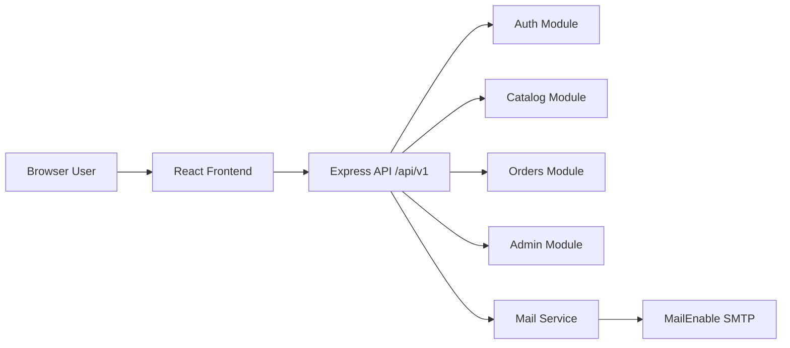

# Architecture Overview

- Frontend communicates with backend REST endpoints through Vite proxy in development.
- Backend currently uses in-memory stores as integration scaffolding pending separate DB implementation.
